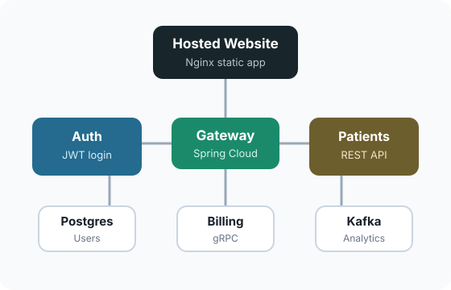

# PulseBridge

## Project Overview

PulseBridge is a local-only patient management platform built with Java Spring microservices. It provides a web dashboard for managing patient records and demonstrates backend patterns such as API gateway routing, JWT authentication, gRPC service communication, PostgreSQL persistence, and Kafka-based event streaming.



## Demo Login

```text
Email: testuser@test.com
Password: password123
```

## Key Features

### Secure Authentication

- JWT-based login flow
- Auth service validates tokens for protected API routes
- API Gateway blocks unauthorized patient API requests

### Patient Management

- View seeded patient records
- Create new patient records
- Update existing patient details
- Delete patient records
- Search patients from the dashboard

### Microservice Architecture

- Independent services for auth, patients, billing, analytics, and gateway routing
- Service-to-service communication through REST and gRPC
- Clear separation of frontend, gateway, business services, databases, and event streaming

### Event-Driven Analytics

- Patient creation publishes Kafka events
- Analytics service consumes patient events asynchronously

### Local Web Dashboard

- Nginx-served frontend
- Same-origin API proxying through Nginx
- Responsive dashboard layout for patient operations

## Tech Stack

### Frontend

- HTML
- CSS
- JavaScript
- Nginx

### Backend

- Java 21
- Spring Boot
- Spring Cloud Gateway
- Spring Security
- Spring Data JPA

### Communication

- REST APIs
- gRPC
- Kafka

### Database

- PostgreSQL

### Local Runtime

- Docker
- Docker Compose

## System Services

```text
web                 Local frontend served by Nginx
api-gateway         Routes frontend requests to backend services
auth-service        Handles login and JWT validation
patient-service     Manages patient records
billing-service     Creates billing accounts over gRPC
analytics-service   Consumes patient events from Kafka
auth-service-db     PostgreSQL database for users
patient-service-db  PostgreSQL database for patients
kafka               Event broker for patient events
```

## How It Works

1. User opens the local PulseBridge website.
2. User logs in with the demo account.
3. Auth service returns a signed JWT.
4. Frontend sends the JWT with patient API requests.
5. API Gateway validates the token through the auth service.
6. Patient service handles CRUD operations with PostgreSQL.
7. Creating a patient triggers billing account creation over gRPC.
8. Patient service publishes a Kafka event.
9. Analytics service consumes the event for downstream analytics.

## Run Locally

Start the app:

```bash
docker compose up --build
```

Open:

```text
http://localhost:8080
```

Stop the app:

```bash
docker compose down
```

Reset local data:

```bash
docker compose down -v
```

## Smoke Test

With the app running locally:

```bash
./scripts/smoke-test.sh
```

The smoke test verifies login, patient list, patient create, and patient delete.

## Key Differentiators

- End-to-end microservice flow from web dashboard to backend services
- API Gateway protects patient routes with JWT validation
- gRPC integration between patient and billing services
- Kafka integration for asynchronous patient events
- Dockerized setup for repeatable local execution

## Future Roadmap

- Role-based access control
- Patient analytics dashboard
- Audit logs for patient changes
- Expanded integration test coverage

## Acknowledgements

- Spring Boot
- Spring Cloud Gateway
- PostgreSQL
- Kafka
- gRPC
- Docker
